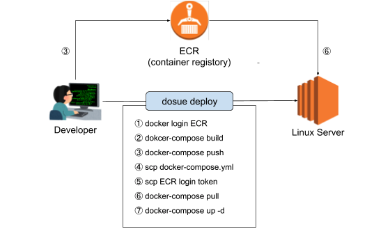

# DOSUE
DOcker compose SUper Express deployment tool

## INTRODUCTION
`dosue` is a small commandline tool



`dosue` aims deploying docker container service more easily and comfortably

we want to deploy small service written in docker-compose.yml to remote server by one command

`dosue` wraps following process in one command
- `docker login` to `ECR` in local machine
- `docker-compose build` in local machine
- `docker-compose push` in local machine
- copy `docker-compoe.yml` to remote server
- copy `.env` to remote server if you needed
- `docker login` to `ECR` in remote server using credential in local machine
- `docker-compose pull` in remote server
- `docker-compose up -d` in remote server

Therefore, services deployed by dosue can not scale out

dosue is suited environment like small internal tool created by docker-compose

## INSTALL COMMAND
```sh
curl -L -o /usr/local/bin/dosue https://raw.githubusercontent.com/garicchi/dosue/master/dosue.sh;chmod u+x /usr/local/bin/dosue
```

## SETUP SERVER
```
# only install docker and nginx
curl https://raw.githubusercontent.com/garicchi/dosue/master/setup.sh|bash
```

## UNINSTALL COMMAND
```sh
rm /usr/local/bin/dosue
```

## REQUIREMENTS
- enable ssh access to remote server and run `ssh-add <key>` with ssh-agent
```sh
ssh-add <path to ssh private key to remote server>
```
- enable to run `docker` and `docker-compose` command in remote server by normal user
```sh
ssh <remote server>
# if you use amazon linux on EC2
#   install docker
sudo yum update -y&&sudo yum install -y docker&&sudo service docker start&&sudo usermod -a -G docker ec2-user
#   install docker-compose
sudo curl -L "https://github.com/docker/compose/releases/download/1.24.0/docker-compose-$(uname -s)-$(uname -m)" -o /usr/local/bin/docker-compose&&sudo chmod +x /usr/local/bin/docker-compose
```

- add image tag in your docker-compose.yml
  - dosue will pull image from registory written in image tag
```yml
services:
  web:
    # build tag uses to develop container in local machine
    build:
      context: ./web
    # image tag uses push or pull
    image: <***>.amazonaws.com/<image name>
```

- [ECR ONLY]enable `aws` command and login using `aws configure`
```sh
aws configure
```


## MANAGE CONTAINER

### DEPLOY
```sh
# move service root directory
cd <path to docker-compose.yml dir>

# develop code!

# confirm application in local machine
docker-compose build && docker-compose up

# ok! terminate
^C

# deploy container
#  dosue recognize ${AWS_PROFILE} environment variable
dosue --server <user@host> --registory ecr deploy

# check container status
dosue --server <user@host> status
```

### CLEANUP
```sh
# move service root directory
cd <path to docker-compose.yml dir>

dosue --server <user@host> --registory ecr cleanup
```

## SUPPORT CONTAINER REGISTORY
- [x] DockerHub
- [x] ECR in AWS
- [ ] GCR in GCP

## TIPS

### CHANGE AWS PROFILE
set environment variable `DOSUE_AWS_PROFILE`

```
export DOSUE_AWS_PROFILE
```

### COPY EXTERNAL SCRIPTS OR FILE TO REMOTE WITH DEPLOY
`<path/to/docker-compose.yml>/bin/` directory will also copy when deploy dosue
so if you write external script in `bin/` directory then those scripts copy in remote server
